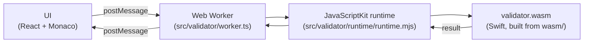

# swift-json-schema-playground

[](https://github.com/ajevans99/swift-json-schema-playground/actions/workflows/deploy.yml)
[](https://ajevans99.github.io/swift-json-schema-playground/)

An in-browser playground for [JSON Schema](https://json-schema.org). You paste a
schema in one pane and an instance in the other, and the page tells you, as you
type, whether the instance validates — with inline error squiggles and a
clickable error list.

The interesting bit is what's doing the validation: it's
[`swift-json-schema`](https://github.com/ajevans99/swift-json-schema), a Swift
package, compiled to WebAssembly with [SwiftWasm](https://swiftwasm.org) and
hosted in a Web Worker. No server, no round-trip — the whole validator runs in
your browser.

## Features

- **As-you-type validation** with a ~300 ms debounce so you don't pay for a
  validation on every keystroke.
- **Two-pane Monaco editor** (schema | instance) with JSON syntax highlighting,
  bracket matching, and folding.
- **Inline error squiggles** plus a side panel that lists every error and lets
  you click to jump to the offending position.
- **Light/dark mode** that follows your OS color scheme automatically.
- **Persistent state** — your last schema and instance are kept in
  `localStorage`, so a reload doesn't lose your work.
- **Off-main-thread validation** — the wasm runs in a Web Worker, so a slow
  validation never freezes the UI.

## Stack

| Layer            | Choice                                                                 |
| ---------------- | ---------------------------------------------------------------------- |
| Build            | [Vite 8](https://vite.dev) + [React 19](https://react.dev) + TypeScript |
| Styling          | [Tailwind CSS v4](https://tailwindcss.com) (CSS-first, no `tailwind.config.js`) |
| Editor           | [`@monaco-editor/react`](https://github.com/suren-atoyan/monaco-react) (Monaco 0.55) |
| Tests            | [Vitest 4](https://vitest.dev) + Testing Library + jsdom                |
| Validator        | [`swift-json-schema` 0.13.0](https://github.com/ajevans99/swift-json-schema/releases/tag/v0.13.0), Swift 6.3.1 |
| Swift→Wasm       | [SwiftWasm](https://swiftwasm.org) `swift-6.3.1-RELEASE_wasm` SDK, managed via [`swiftly`](https://github.com/swiftlang/swiftly) |
| Swift↔JS bridge  | [JavaScriptKit 0.51](https://github.com/swiftwasm/JavaScriptKit)        |
| WASI host        | [`@bjorn3/browser_wasi_shim`](https://github.com/bjorn3/browser_wasi_shim) |

Versions are pinned in `package.json` and `wasm/build.sh` — that table is a
snapshot, not the source of truth.

## Architecture



The flow:

1. The React app debounces edits and posts the current schema + instance to a
   Web Worker.
2. The worker boots the wasm module once (using `@bjorn3/browser_wasi_shim`
   for WASI syscalls and a vendored copy of the JavaScriptKit JS runtime
   under `src/validator/runtime/` for the Swift↔JS bridge).
3. Swift validates and sends the result back across `postMessage`.
4. The UI maps each error's JSON Pointer to a Monaco range and draws squiggles.

Doing this off the main thread matters because the wasm is large (see
[Why is the wasm so big?](#why-is-the-wasm-so-big)) and a cold validation can
take long enough to drop a frame.

## Repository layout

```
.
├── .github/workflows/deploy.yml   # CI: build wasm + Vite, deploy to Pages
├── public/
│   └── validator.wasm             # built artifact (gitignored)
├── src/                           # React app
│   ├── components/                # Header, MonacoJsonEditor, SchemaEditor,
│   │                              # InstanceEditor, ResultsPanel
│   ├── editor/                    # Monaco setup + JSON-pointer→range mapping
│   ├── validator/                 # Web worker, main-thread client, types,
│   │   └── runtime/               # vendored JavaScriptKit JS runtime
│   ├── App.tsx
│   ├── main.tsx
│   ├── storage.ts                 # localStorage helpers
│   └── index.css                  # Tailwind v4 entry
├── tests/                         # Vitest unit tests
└── wasm/                          # SwiftPM project that builds the validator
    ├── Package.swift              # pins swift-json-schema
    ├── Sources/JSONSchemaWasm/main.swift
    └── build.sh                   # builds and copies wasm to ../public/
```

## Prerequisites

For just running the JS app (you can skip the Swift toolchain if you don't
need to rebuild `validator.wasm`):

- **Node.js 20+** — CI tests on Node 24.

For rebuilding the wasm validator:

- [`swiftly`](https://github.com/swiftlang/swiftly), used to install
  **Swift 6.3.1** — the system `/usr/bin/swift` from Xcode does **not** work
  because it lacks the WebAssembly LLVM backend.
- The matching **SwiftWasm SDK** (`swift-6.3.1-RELEASE_wasm`).
If either Swift prerequisite is missing, `wasm/build.sh` fails fast and prints
the exact `swiftly install …` / `swift sdk install …` commands you need.

## Local development

```bash
# 1. Build the wasm validator (only needed once, or after Swift changes).
cd wasm && ./build.sh && cd ..

# 2. Install JS deps.
npm install

# 3. Start the dev server.
npm run dev
# → http://localhost:5173/swift-json-schema-playground/

# 4. Run tests.
npm test
```

Other useful scripts:

```bash
npm run build      # type-check + Vite production build into ./dist
npm run preview    # serve the production build locally
npm run lint       # ESLint
npm run test:watch # Vitest in watch mode
```

`public/validator.wasm` is gitignored — `wasm/build.sh` writes it, and CI
rebuilds it on every deploy.

## Deployment

Pushes to `main` trigger
[`.github/workflows/deploy.yml`](.github/workflows/deploy.yml), which:

1. Checks out this repo.
2. Installs Swift 6.3.1 via `swiftly` (cached) and the pinned SwiftWasm SDK
   (cached).
3. Runs `wasm/build.sh` to produce `public/validator.wasm`.
4. Installs npm deps (`npm ci`), runs tests, and builds the Vite site.
5. Uploads `dist/` and deploys it via the official GitHub Pages actions
   (`configure-pages`, `upload-pages-artifact`, `deploy-pages`) — no
   `gh-pages` branch, no force-pushing.

### One-time setup

1. Push this repo to GitHub.
2. **Settings → Pages → Build and deployment → Source = "GitHub Actions"**.
3. Keep the `swift-json-schema` version in `wasm/Package.swift` pinned to the
   release you want to deploy.

## Why is the wasm so big?

`public/validator.wasm` clocks in around **60 MiB**. That is a lot of bytes,
and it's worth being upfront about why.

SwiftWasm currently bundles a substantial chunk of the Swift runtime and
standard library into every executable — there's no shared system-wide Swift
runtime in the browser the way there is for, say, the JS engine itself. The
build already uses release-mode optimization (`-O`), and the SDK's linker
performs dead-code stripping, but the floor is still multiple megabytes for
anything non-trivial.

Things that help in practice:

- GitHub Pages serves the file gzipped, which knocks the wire size down
  significantly versus the on-disk figure.
- The wasm is loaded once per session by the worker and then cached by the
  browser like any other static asset.
- Validation itself runs in a Web Worker, so even on a cold load the main
  thread stays responsive.

This is the current state of the art for full Swift→Wasm. If/when SwiftWasm
gains better runtime sharing, tree-shaking, or split modules, the size will
come down — but you should expect a multi-MB asset today.

## Acknowledgements

This project is mostly glue around other people's excellent work:

- [`swift-json-schema`](https://github.com/ajevans99/swift-json-schema) — the
  validator that does all the actual work.
- [SwiftWasm](https://swiftwasm.org) — the toolchain that makes Swift in the
  browser possible.
- [JavaScriptKit](https://github.com/swiftwasm/JavaScriptKit) — the Swift↔JS
  bridge.
- [`@bjorn3/browser_wasi_shim`](https://github.com/bjorn3/browser_wasi_shim) —
  hosts the WASI executable in the browser.
- [JSON Schema](https://json-schema.org) — the spec.
